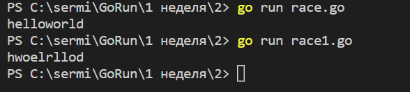

По умолчанию отправление и получение блокируются до тех пор, пока другая сторона не готова. Это позволят go-процедурам синхронизироваться без явного использования блокировок и условных переменных.

